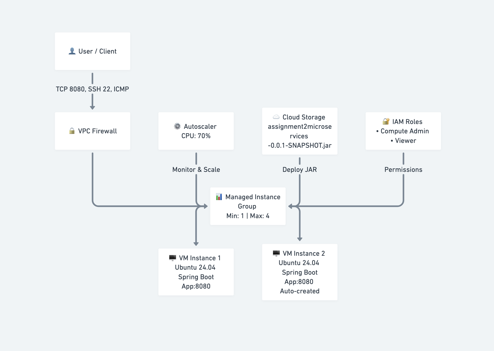

# 📘 Virtualization and Cloud Computing Assignment 2

---

## Title 

Deployment of a Spring Boot Microservice on Google Cloud VMs with Auto Scaling and Security

---

## Course  

Virtualization and Cloud Computing

---

## 🎯 Objective

This assignment demonstrates the practical application of cloud virtualization concepts by deploying a Spring Boot–based microservice on Google Cloud Virtual Machines. The system leverages Managed Instance Groups to automatically scale VM instances based on CPU utilization while enforcing security through IAM roles and VPC firewall rules.

---

## 🛠 Technologies Used

- Google Cloud Platform (Compute Engine, Managed Instance Groups, Cloud Storage, IAM)
- Ubuntu 24.04 LTS
- Java 21
- Spring Boot
- Maven
- Stress Utility

---

## ☁ Virtual Machine Configuration

| Component | Role | Technology |
|-----------|------|------------|
| VM Instances | Application Server | Ubuntu + Java + Spring Boot |
| Managed Instance Group | Auto Scaling | CPU-based Autoscaler |
| Cloud Storage | Artifact Storage | Application JAR |
| IAM | Access Control | Compute Admin, Viewer |
| VPC Firewall | Network Security | TCP 8080, SSH 22, ICMP |

All VM instances are created using an Instance Template and automatically managed through a Managed Instance Group.

---

## 🏗 System Architecture

The system follows a cloud-native scalable architecture:

### User / Client
- Accesses the application through firewall rules

### Application Layer (Managed Instance Group)
- Multiple VM instances running the same Spring Boot microservice
- Automatically scales based on CPU utilization

### Autoscaler
- Monitors CPU usage
- Creates or removes VM instances dynamically

### Cloud Storage
- Stores the executable JAR file used for deployment

### Security Layer
- IAM roles provide role-based access control
- VPC firewall restricts incoming traffic

---

## 🏗 Architecture Diagram



Figure: Spring Boot microservice deployment on Google Cloud using Managed Instance Groups with CPU-based auto scaling and security controls.

---

## 🔗 Application Endpoint

Health Check API: GET /health
```bash
    Response: APPLICATION RUNNING SUCCESSFULLY
```


---

## ⚙ Build and Deployment

### Build Application

```bash
    mvn clean package
```

### Generated artifact

```bash
    target/assignment2microservices-0.0.1-SNAPSHOT.jar
```

### Deployment on VM

```bash

sudo apt update
sudo apt install openjdk-21-jdk -y
gsutil cp gs://<bucket-name>/assignment2microservices-0.0.1-SNAPSHOT.jar .
java -jar assignment2microservices-0.0.1-SNAPSHOT.jar
```

### Verification

```bash

curl http://localhost:8080/health
```

### 📈 Load Testing

CPU load generated using:
```bash

sudo apt install stress -y
sudo stress -c 70
```
Additional VM instances are automatically created when CPU usage exceeds the threshold and removed once the load decreases.

---

## 📂 Repository Structure
assignment2-gcp-vm-autoscaling/  
│── src/  
│── pom.xml  
│── README.md  
│── gcp-vm-autoscaling-microservices.png  
│── Aryan Baranwal VCC Assignment 2.pdf

---
## 📄 Assignment Report (PDF)
A detailed assignment report is included:

📘 [Click here to view the Assignment Report](Aryan Baranwal VCC Assignment 2.pdf)

---

## 🎓 Learning Outcomes

- Practical experience with cloud virtualization
- Understanding of Managed Instance Groups
- Implementation of CPU-based auto scaling
- Secure VM deployment using IAM and firewall rules
- Hands-on exposure to cloud-native system design

---

## 👤 Author

Aryan Baranwal  
Roll No: M25CSE035  
M.Tech (CSE)  

---

## ⚠ Note

This repository is created strictly for academic purposes.

--- 
